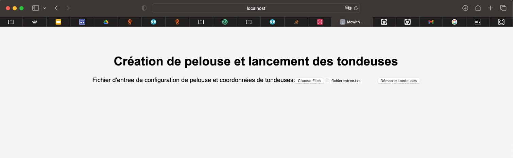
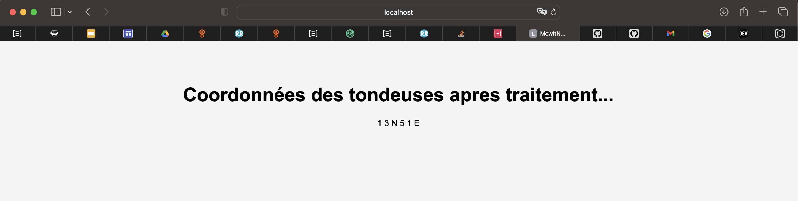
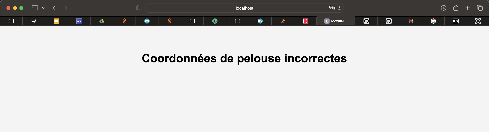
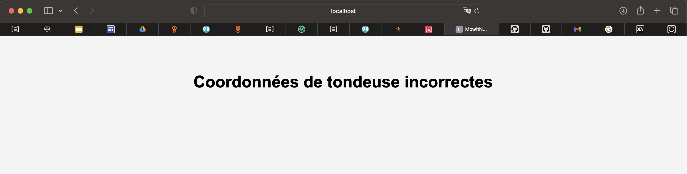
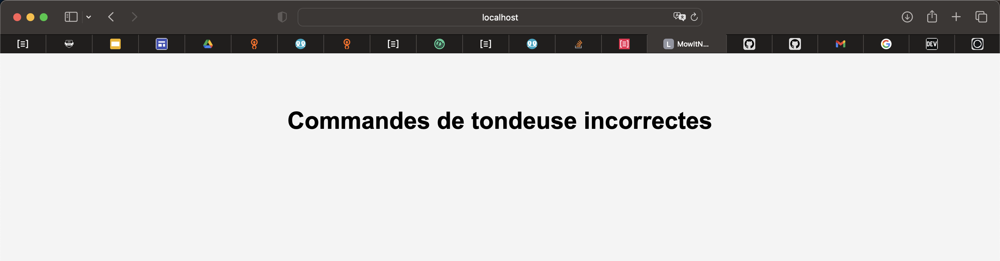
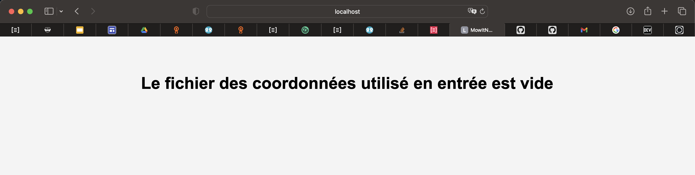
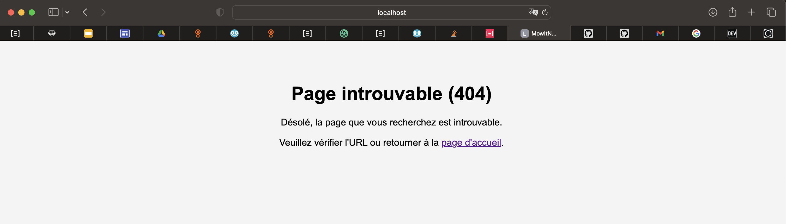

# Tondeuse à gazon MowItNow

## Description 

La société MowItNow a décidé de développer une tondeuse à gazon automatique, destinée aux surfaces rectangulaires.

La tondeuse peut être programmée pour parcourir l'intégralité de la surface. La position de la tondeuse est représentée par une combinaison de coordonnées (x,y) et d'une lettre indiquant l'orientation selon la notation cardinale anglaise (N,E,W,S). La pelouse est divisée en grille pour simplifier la navigation.
La position de la tondeuse est représentée par une combinaison de coordonnées et d'une lettre indiquant l'orientation selon la notation cardinale anglaise (N-E-S-W). La pelouse est divisée en grille pour simplifier la navigation.

Pour contrôler la tondeuse, on lui envoie une séquence simple de lettres. Les lettres possibles sont « D », « G » et « A ». « D » et « G » font pivoter la tondeuse de 90° à droite ou à gauche respectivement, sans la déplacer. « A » signifie que l'on avance la tondeuse d'une case dans la direction à laquelle elle fait face, et sans modifier son orientation. 
Si la position après mouvement est en dehors de la pelouse, la tondeuse ne bouge pas, conserve son orientation et traite la commande suivante.

Pour programmer la tondeuse, un fichier d'entrée est utilisé selon le format suivant :

La première ligne indique les coordonnées du coin supérieur droit de la pelouse, avec le coin inférieur gauche supposé être (0,0).

Chaque tondeuse est décrite par deux lignes :
- La première ligne spécifie sa position initiale et son orientation, sous la forme de deux chiffres et une lettre, séparés par un espace. 
- La deuxième ligne contient une série d'instructions pour guider la tondeuse dans l'exploration de la pelouse. Ces instructions sont fournies sous forme d'une séquence de  caractères sans espaces.

Chaque tondeuse se déplace de manière séquentielle, ce qui signifie que la deuxième tondeuse ne commence à se déplacer que lorsque la première a complètement terminé sa série d'instructions.         

Une fois qu'une tondeuse a exécuté toutes ses instructions, elle communique sa nouvelle position et son orientation.


## Objectif
Développer et mettre en place une application simulant le fonctionnement d'une tondeuse à gazon tel que décrit dans le paragraphe précédent.

## Test
Le fichier suivant est fourni en entrée : 5 5 1 2 N GAGAGAGAA 3 3 E AADAADADDA On attend le résultat suivant (position finale des tondeuses) : 1 3 N 5 1 E NB: Les données en entrée sont injectées sous forme de fichier.

## Les choix d'implémentation 
Pour satisfaire les exigences de la société MowItNow, nous pouvons subdiviser notre problème en plusieurs parties :

- La gestion de la pelouse et de sa position 
- La gestion du déplacement de la tondeuse et de sa position 
- Les orientations (coordonnées et orientations : NORD, EST, SUD et OUEST)
- L'implémentation des tests Unitaires et des tests d'Intégration

## Prérequis
- Java JDK 17 ou supérieur
- Maven

## Dépendances du Projet

Ce projet utilise Maven pour la gestion des dépendances. Les dépendances principales sont répertoriées dans le fichier `pom.xml`. Ci-dessous, la liste des dépendances utilisées :

- **spring-boot-starter-web** : Cette dépendance fournit des fonctionnalités pour le développement d'applications web avec Spring Boot, y compris la gestion des requêtes HTTP et des contrôleurs.
- **spring-boot-starter-thymeleaf** : Cette dépendance fournit un moteur de template permettant de créer des vues HTML dans les applications Spring Boot.
- **lombok** : Cette dependance simplifie la création de classes Java en générant automatiquement du code boilerplate tel que les accesseurs et les constructeurs. 
- **commons-lang3** : Cette dépendance fournit une bibliothèque d'utilitaires pour la manipulation de chaînes, les opérations sur les tableaux, etc.
- **commons-collections4** : Cette dépendance offre une collection d'extensions et de classes utilitaires pour les collections Java, offrant des fonctionnalités supplémentaires par rapport aux collections standard.
- **spring-boot-starter-test** : Cette dépendance contient des outils et des annotations pour écrire des tests unitaires et d'intégration avec Spring Boot, y compris JUnit et Mockito. 
- **io.cucumber.cucumber-java**, **cucumber-junit-platform-engine** et **io.cucumber.cucumber-spring** :  Ces dépendances sont utilisées pour la mise en œuvre des tests d'acceptation et des scénarios BDD (Behavior-Driven Development) avec le framework Cucumber dans les applications Java. 
- **junit-jupiter-api** : Cette dépendance fournit les API nécessaires pour écrire des tests unitaires avec JUnit 5.
- **junit-platform-suite** : Cette dépendance permet de créer des suites de tests personnalisées dans JUnit 5 en regroupant plusieurs classes de tests ou méthodes de test.
- **selenium-java** : Cette dépendance est utilisée pour l'automatisation des tests fonctionnels à travers des interactions avec des navigateurs web.

## Installation
1. Clonez ce dépôt sur votre machine locale.
    ```
    git clone $GIT_URL
    ```
   Avec **$GIT_URL** l'url de projet GIT. 
   Dans nôtre cas, le GIT_URL correspond à **https://github.com/badrman/tondeusemowItnow.git**


2. Accédez au répertoire racine de l'application.
3. Exécutez la commande suivante pour compiler l'application :
    ```
    mvn clean install
    ```
## Architecture
L'architecture hexagonale, également connue sous le nom d'architecture ports et adaptateurs, est utilisée dans cette application pour séparer les préoccupations et rendre le code plus modulaire et testable.

Dans cette architecture :
- Le cœur de l'application est représenté par le package **com.mowitnow.tondeuse.domain**, qui contient la logique métier de traitement des tondeuses et des POJOs.
- La couche d'application, située dans le package **com.mowitnow.tondeuse.application**, englobe les points d'accès principaux de l'application, notamment les classes de contrôleurs.
- Le package **com.mowitnow.tondeuse.infrastructure** est une version allégée de la couche infrastructure dans une architecture hexagonale. Il contient uniquement la configuration Spring des services utilisés dans la couche domaine, sans inclure d'adaptateurs pour accéder à la base de données.

## Tests
### Tests unitaires JUnit
Les tests unitaires sont utilisés pour tester les composants individuels de l'application de manière isolée. Ils sont écrits à l'aide du framework JUnit.

Pour exécuter les tests unitaires, exécutez la commande suivante :

```bash
mvn clean test -Punitaire-test
```

## Exécution des Tests d'Intégration avec Cucumber et Selenium

Les tests d'intégration sont essentiels pour valider le bon fonctionnement de l'application dans son ensemble, en testant l'interaction entre ses différentes parties. Dans ce projet, nous utilisons Cucumber pour écrire des scénarios de test en Gherkin et Selenium pour automatiser les interactions avec l'interface utilisateur.

### Exécution des Tests

Pour lancer les tests d'intégration, exécutez la commande suivante à partir de la ligne de commande :

```bash
mvn clean test -Pintegration-test
```

Nous avons défini le profil Maven **integration-test** spécifiquement pour ce type des tests.

Les scénarios de test Gherkin sont répertoriés dans le fichier **src/test/resources/features/tondeusescenarios.feature**.

```text
# Author Berrami Badr
# Date 01/03/2024
# Description
@smokeFeatures
Feature: feature pour simuler l'exécution des tondeuses : cas nominal et cas d'echec
  @smokeTestByBrowser
  Scenario: Cas nominal - Démarrer l'exécution des tondeuses
    Given utilisateur ouvre le navigateur
    And utilisateur charge le fichier de coordonnées fichierentree.txt
    When utilisateur clique sur upload
    Then resultat d'execution "1 3 N 5 1 E" est affiché
    Then utilisateur ferme navigateur

  @smokeTestByBrowser
  Scenario: Cas d'erreur - Démarrer l'exécution des tondeuses avec un fichier d'entree en erreur : "Coordonnées pelouse incorrectes"
    Given utilisateur ouvre le navigateur
    And utilisateur charge le fichier de coordonnées pelouseenerreur.txt
    When utilisateur clique sur upload
    Then message d'erreur "Coordonnées de pelouse incorrectes" est affiché
    Then utilisateur ferme navigateur

  @smokeTestByBrowser
  Scenario: Cas d'erreur - Démarrer l'exécution des tondeuses avec un fichier d'entree en erreur : "Coordonnees de tondeuse incorrectes"
    Given utilisateur ouvre le navigateur
    And utilisateur charge le fichier de coordonnées coordonneestondeuseenerreur.txt
    When utilisateur clique sur upload
    Then message d'erreur "Coordonnées de tondeuse incorrectes" est affiché
    Then utilisateur ferme navigateur

  @smokeTestByBrowser
  Scenario: Cas d'erreur - Démarrer l'exécution des tondeuses avec un fichier d'entree en erreur : "Commandes de tondeuse incorrectes"
    Given utilisateur ouvre le navigateur
    And utilisateur charge le fichier de coordonnées commandestondeuseenerreur.txt
    When utilisateur clique sur upload
    Then message d'erreur "Commandes de tondeuse incorrectes" est affiché
    Then utilisateur ferme navigateur
    
  @smokeTestByBrowser
  Scenario: Cas d'erreur - fichier en entrée vide
    Given utilisateur ouvre le navigateur
    And utilisateur charge le fichier de coordonnées fichiervide.txt
    When utilisateur clique sur upload
    Then message d'erreur "Le fichier des coordonnées utilisé en entrée est vide" est affiché
    Then utilisateur ferme navigateur
```

Les fichiers texte utilisés en entrée pour les tests de l'application sont répertoriés dans le dossier **src/test/resources/files**.

- **fichierentree.txt** : Un fichier d'entrée valide permettant de réussir le scénario nominal.
- **fichiervide.txt** : Pour tester le scénario d'un fichier d'entée vide.
- **pelouseenerreur.txt** : Pour tester le cas d'erreur concernant les coordonnées de la pelouse.
- **coordonneestondeuseenerreur.txt** : Pour tester le cas d'erreur concernant les coordonnées de la tondeuse.
- **commandestondeuseenerreur.txt** : Pour tester le cas d'erreur concernant les commandes de la tondeuse.

## Lancement de l'Application

Pour démarrer l'application, veuillez exécuter la commande suivante dans un terminal :

```bash
mvn spring-boot:run
```

Voici les liens permettant d'accéder à l'application :

- http://localhost:8080/
- http://localhost:8080/index

### Chargement de Fichier d'entrée des coordonnées

1) Sur la page d'accueil (http://localhost:8080/index), vous découvrirez un formulaire permettant de charger le fichier des coordonnées de la pelouse, ainsi qu'un bouton pour démarrer l'exécution des tondeuses (consultez la figure ci-dessous).



Charger le fichier, puis cliquer sur le bouton **Démarrer tondeuses**.

2) Une fois le traitement des tondeuses terminé, l'utilisateur est dirigé vers une page de résultats (consultez l'image ci-dessous).



### Affichage des Erreurs

Si une erreur survient, l'utilisateur est automatiquement dirigé vers une page d'erreur qui affiche le message précis de l'anomalie.
- Cas d'erreur dans les coordonnées de la pelouse :



- Cas d'erreur dans les coordonnées de la tondeuse :



- Cas d'erreur dans les commandes de la tondeuse :



- En cas d'un fichier d'entrée vide, le système affiche la page suivante :



### Gestion des Pages Inconnues

Enfin, l'application gère également les demandes de pages ou d'URL inconnues en affichant une page d'erreur personalisée.


